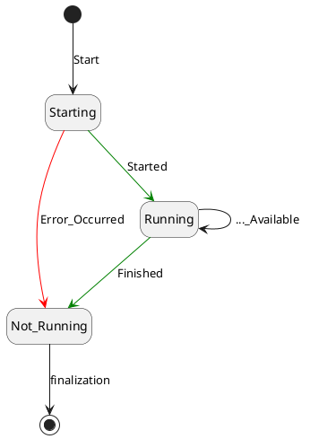

# Process State diagram

```plantuml
@startuml
hide empty description

[*]         -->          Starting    : Start
Starting    -[#red]->    Not_Running : Error_Occurred
Starting    -[#green]->  Running     : Started
Running     -->          Running     : ..._Available
Running     -[#green]->  Not_Running : Finished
Not_Running -->          [*]         : finalization

@enduml
```
